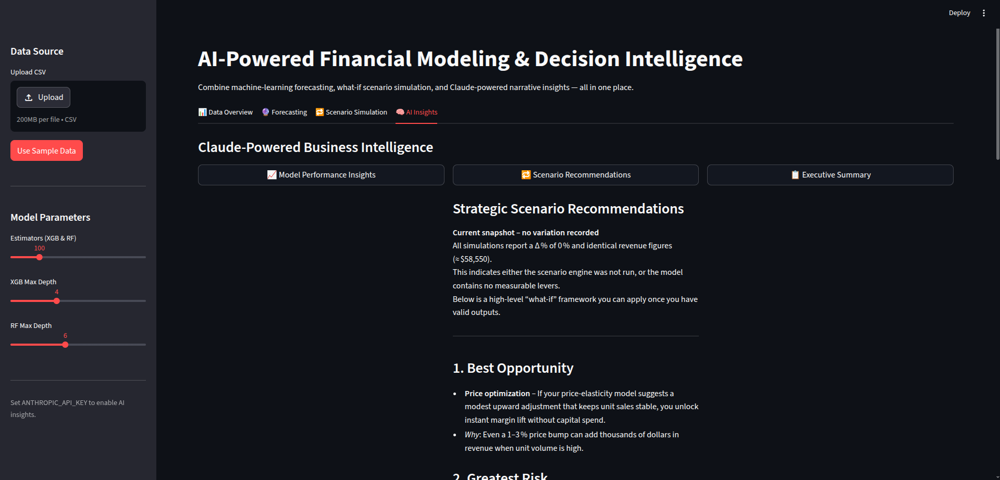
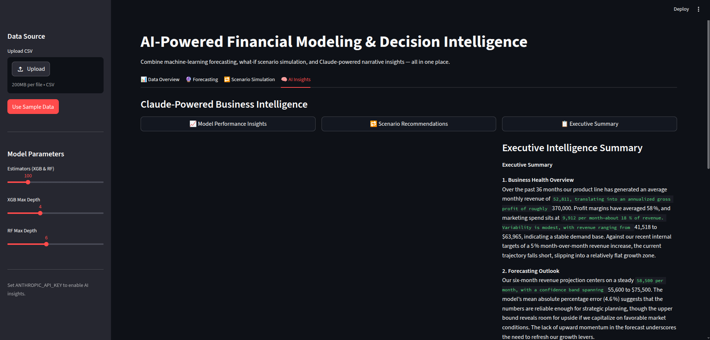
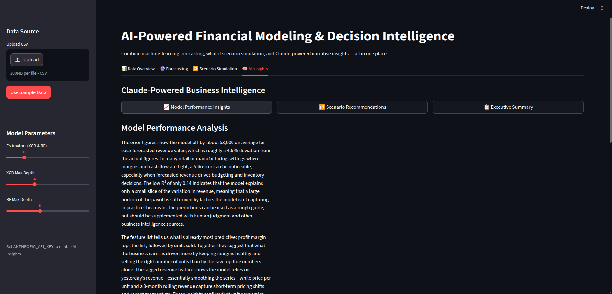
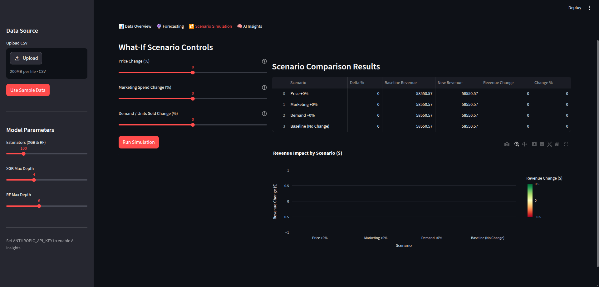
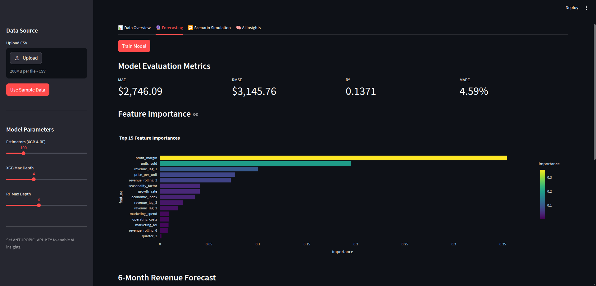
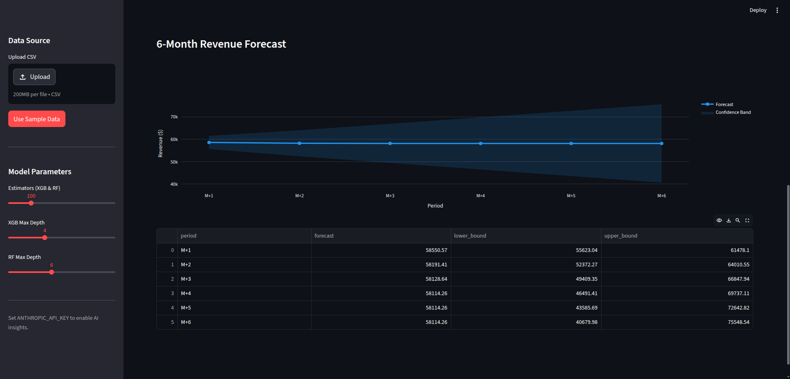
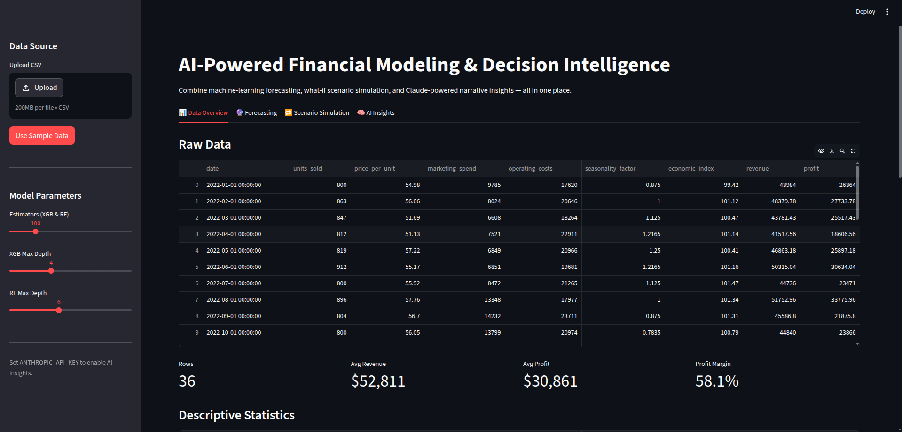
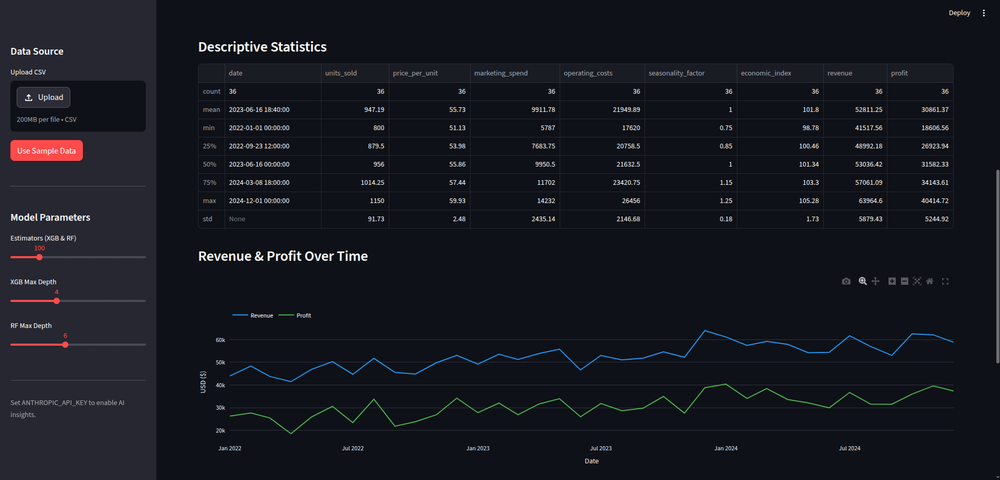
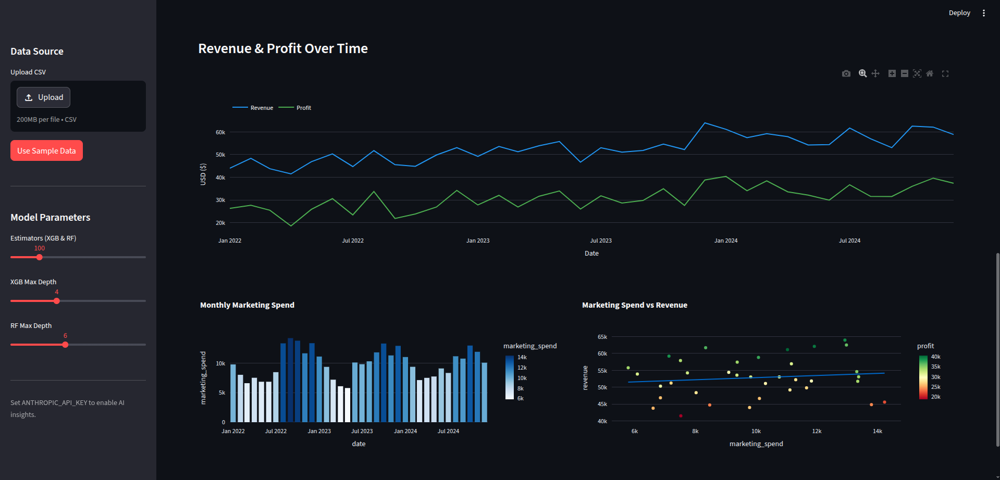

# AI-Powered Financial Modeling & Decision Intelligence

A complete end-to-end system that combines machine-learning revenue forecasting (XGBoost + RandomForest ensemble), interactive what-if scenario simulation, and Claude-powered narrative insights to help business leaders make smarter financial decisions — all accessible through a clean Streamlit dashboard or a CLI runner.

---

## Architecture

```
┌──────────────┐     ┌──────────────────────┐     ┌──────────────────────┐
│  data/       │────▶│  utils/              │────▶│  models/             │
│  generate_   │     │  feature_engineering │     │  forecasting.py      │
│  data.py     │     │  .py                 │     │  scenario_engine.py  │
│              │     │  (lag, rolling,      │     │  (XGBoost + RF       │
│  Synthetic   │     │   ratios, dummies)   │     │   ensemble)          │
│  CSV data    │     └──────────────────────┘     └──────────┬───────────┘
└──────────────┘                                             │
                                                             ▼
                                                  ┌──────────────────────┐
                                                  │  insights/           │
                                                  │  ai_insights.py      │
                                                  │  (Claude API →       │
                                                  │   narrative text)    │
                                                  └──────────┬───────────┘
                                                             │
                                                             ▼
                                                  ┌──────────────────────┐
                                                  │  dashboard/app.py    │
                                                  │  (Streamlit UI)      │
                                                  │   OR                 │
                                                  │  main.py (CLI)       │
                                                  └──────────────────────┘
```

---

## Project Structure

```
financial_ai_system/
├── data/
│   ├── generate_data.py          # Synthetic 3-year monthly dataset generator
│   └── sample_data.csv           # Auto-generated on first run
├── models/
│   ├── __init__.py
│   ├── forecasting.py            # XGBoost + RF ensemble forecaster
│   └── scenario_engine.py        # What-if scenario simulation
├── insights/
│   ├── __init__.py
│   └── ai_insights.py            # Claude API integration
├── dashboard/
│   ├── __init__.py
│   └── app.py                    # Streamlit interactive dashboard
├── utils/
│   ├── __init__.py
│   └── feature_engineering.py    # Feature engineering & preprocessing
├── main.py                       # CLI entry point
├── requirements.txt
├── config.py                     # Configuration & model hyper-params
└── README.md
```

---

## Setup

### 1. Install dependencies

```bash
cd financial_ai_system
pip install -r requirements.txt
```

### 2. Configure API keys (optional)

Edit the `.env` file in the project root:

```env
GEMINI_API_KEY_1=your-gemini-key-1
GEMINI_API_KEY_2=your-gemini-key-2
ANTHROPIC_API_KEY=your-claude-key
```

**No keys required** — the app automatically falls back to Pollinations.ai and OllamaFreeAPI (both free, no signup) if your keys are missing or quota is exhausted. All ML features and AI insights work out of the box.

### 3. Generate sample data (optional — auto-generated on first run)

```bash
python data/generate_data.py
```

---

## How to Run

### CLI mode

```bash
python main.py                   # Full pipeline with existing data
python main.py --generate-data   # Regenerate synthetic data first
```

### Streamlit dashboard

```bash
streamlit run dashboard/app.py
```

Open the browser at `http://localhost:8501`.

---

## Component Descriptions

| Component | Description |
|-----------|-------------|
| `data/generate_data.py` | Generates 36 months of realistic synthetic business data with trend, seasonality, marketing surges, and correlated noise. |
| `utils/feature_engineering.py` | `FeatureEngineer` class — adds lag features, rolling means, calendar dummies, growth rate, marketing ROI, and profit margin; splits into chronological train/test sets. |
| `models/forecasting.py` | `FinancialForecaster` — trains an XGBoost + RandomForest ensemble, evaluates with MAE / RMSE / R² / MAPE, generates iterative 6-month forward forecasts with confidence bands, and supports joblib serialisation. |
| `models/scenario_engine.py` | `ScenarioEngine` — simulates revenue impact of percentage changes to price, marketing spend, or demand; runs full sensitivity sweeps and multi-scenario comparisons. |
| `insights/ai_insights.py` | `AIInsightsEngine` — produces structured performance analyses, scenario recommendations, and board-ready executive summaries via a 5-provider fallback chain: Gemini key 1 → Gemini key 2 → Pollinations.ai (free, no key) → OllamaFreeAPI (free, no key) → Claude. Always returns insights as long as any provider is reachable. |
| `dashboard/app.py` | Four-tab Streamlit app: Data Overview, Forecasting, Scenario Simulation, and AI Insights. Uses Plotly for all charts and Streamlit session state for model persistence. |
| `main.py` | Orchestrates the full pipeline from the command line with formatted console output. |
| `config.py` | Central configuration — API key, model hyper-parameters, data path, test split ratio, and forecast horizon. |


---

## Demo Walkthrough

Follow these steps to explore the full application:

### Step 1 — Load Data
Open the app at `http://localhost:8501`. In the **sidebar**, click **"Use Sample Data"** to load the pre-generated 3-year monthly dataset.



---

### Step 2 — Explore the Data Overview
Navigate to the **📊 Data Overview** tab to see:
- Raw data table with all 36 monthly records
- Key metrics: row count, average revenue, average profit, profit margin
- Revenue & Profit time series chart
- Monthly Marketing Spend bar chart
- Marketing Spend vs Revenue scatter plot with OLS trendline




---

### Step 3 — Train the Forecasting Model
Go to the **🔮 Forecasting** tab and click **"Train Model"**. The system trains an XGBoost + RandomForest ensemble and displays:
- MAE, RMSE, R², and MAPE evaluation metrics
- Top 15 feature importances (bar chart)
- 6-month ahead revenue forecast with confidence bands





---

### Step 4 — Run Scenario Simulations
Switch to the **🔁 Scenario Simulation** tab. Use the sliders to adjust:
- **Price Change (%)** — impact of raising or lowering product price
- **Marketing Spend Change (%)** — effect of budget increases or cuts
- **Demand / Units Sold Change (%)** — volume sensitivity

Click **"Run Simulation"** to see the revenue impact table and comparison bar chart.




---

### Step 5 — Generate AI Insights
Open the **🧠 AI Insights** tab. Click any of the three buttons to get live AI-generated analysis powered by the provider fallback chain (Gemini → Pollinations.ai → OllamaFreeAPI → Claude):

| Button | What it generates |
|--------|------------------|
| 📈 Model Performance Insights | Interprets accuracy metrics and top revenue drivers |
| 🔁 Scenario Recommendations | Strategic action plan based on simulation results |
| 📋 Executive Summary | Board-ready briefing covering health, outlook, and priorities |



---

### Step 6 — CLI Mode (optional)
Run the full pipeline headlessly from the terminal:

```bash
python main.py
```

This executes all six stages — data load → feature engineering → model training → forecast → scenario simulation → AI insights — and prints formatted results to the console.